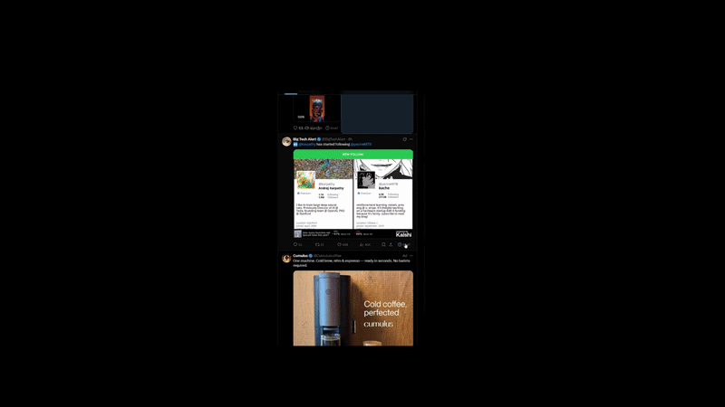

# Grok Is This Real? Checker

A Chrome extension (Manifest V3) that adds a **"Grok?"** button to every tweet on X/Twitter, letting you quickly check if anyone in the replies is asking Grok to fact-check the post.



## Features

- **Inline "Grok?" button** on every tweet's action bar (reply/like/retweet row)
- **One-click scan** of visible replies for phrases like "grok is this real", "@grok is this real", etc.
- **Result popover** shown directly under the tweet with match count and snippet
- **Right-click context menu** to scan any page for the phrase
- **Popup dashboard** showing last scan results with snippets
- Typo-tolerant regex matching (handles "gr0k", "reel", etc.)
- Dark mode + light mode support
- Keyboard accessible (Enter/Space to activate)

## Installation

1. Open Chrome and go to `chrome://extensions/`
2. Enable **Developer mode** (toggle in top-right)
3. Click **"Load unpacked"**
4. Select this folder (`grok-isthisreal`)
5. Navigate to [x.com](https://x.com) — you should see **"Grok?"** buttons on every tweet

## Usage

### Tweet Button
- Click the **"Grok?"** button on any tweet
- It scans visible replies below that tweet for "grok is this real?" variants
- Shows an inline result popover with match count

### Context Menu
- Right-click anywhere on a page → **"Check if 'Grok is this real?' is in comments"**
- Scans the entire visible page DOM
- Results appear in the extension popup

### Popup
- Click the extension icon in Chrome toolbar
- Shows last scan results with snippets
- **"Scan Current Page"** button for on-demand scanning

## File Structure

```
grok-isthisreal/
├── manifest.json       # Extension manifest (MV3)
├── content.js          # Content script (button injection, scanning, MutationObserver)
├── content.css         # Styles for injected button and result popover
├── background.js       # Service worker (context menu, messaging)
├── popup.html          # Extension popup (inline CSS/JS)
├── icons/
│   ├── icon.svg        # Source SVG icon
│   ├── icon16.png      # 16x16 toolbar icon
│   ├── icon48.png      # 48x48 management page icon
│   └── icon128.png     # 128x128 store icon
├── generate-icons.ps1  # PowerShell script to regenerate icons
└── README.md           # This file
```

## Debugging & Selector Updates

X/Twitter frequently changes its DOM structure. If the extension stops working:

### Finding Updated Selectors

1. Open DevTools on x.com (`F12`)
2. Inspect a tweet → look for `<article data-testid="tweet">`
3. If `data-testid="tweet"` changed, search for the new `data-testid` on `<article>` elements
4. For the action bar, look for:
   - `div[role="group"]` with `aria-label` containing "Reply", "Like", "Retweet"
   - `div[data-testid="reply"]` near the action buttons
5. Update the selectors in `content.js`:
   - `TWEET_SELECTOR` — the tweet article selector
   - `ACTION_BAR_SELECTORS` — array of fallback selectors for the action row

### Common Issues

| Problem | Fix |
|---------|-----|
| Buttons not appearing | Check if `TWEET_SELECTOR` still matches (`article[data-testid="tweet"]`) |
| Buttons in wrong position | Update `ACTION_BAR_SELECTORS` — inspect the reply/like row |
| Scanning finds nothing | Check if tweet text is in shadow DOM or iframes (unlikely on X) |
| Double buttons appearing | Verify `.grok-check-btn` check isn't failing — inspect the tweet element |
| Extension not loading | Check `chrome://extensions/` for errors, reload the extension |

### Console Debugging

All logs are prefixed with `[Grok Checker]`. Open DevTools console on x.com and filter by this prefix to see:
- Button injection events
- Scan results and match counts
- MutationObserver activity
- Message passing between content ↔ background ↔ popup

## Permissions

- **contextMenus** — right-click "Check if 'Grok is this real?'" menu item
- **activeTab** — access current tab for scanning
- **scripting** — inject scan script on non-X pages (fallback)
- **storage** — pass results between content script and popup

No external API calls. No data leaves your browser.

## License

MIT
